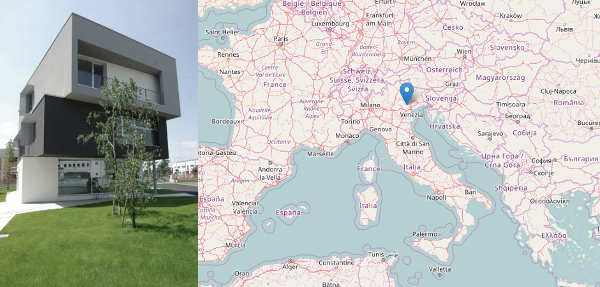

layout: true
.footer[
Stage at Bluewind: company background (www.bluewind.it)
]

???
---

.left-column[
## Background on Bluewind
]

.right-column[
# Bluewind

### Innovative product development World class engineering

Bluewind, an independent engineering company, provides world-class engineering solutions in the domains of electronics, safety critical applications, machine learning on the edge, connected devices.

https://www.bluewind.it
]

???
---

.left-column[
## Background on Bluewind
]

.right-column[

### Where we are

 - Italy
 - I-31033 Castelfranco Veneto
 - Via della Borsa 16

]

???
---

.left-column[
## Background on Bluewind
]

.right-column[
### Mission and vision

Bluewind, an independent engineering company, provides world-class engineering solutions in the domains of electronics, safety critical applications, machine learning on the edge, connected devices.

Our R&D task force consists of 20+ experienced engineers providing full product design and covering the complete development process: product strategy, hardware and software design, test, regulations compliance, and support for production.

The company was founded in 1998 and serves industries located in Europe and the USA, offering wide experience over several application fields.
]

???
---

.left-column[
## Background on Bluewind
]

.right-column[
### Technologies for different domains

Product design requires deep knowledge of the mix of technologies applicable for each specific requirement. Since the beginning, the Bluewind teams have developed a broad range of products covering the entire spectrum of electronics-based objects. As a result, we can now offer extensive knowledge of the broad range of technologies usually encountered when imagining your next product.

Sharing technologies knowledge across domains gives great benefits when working with Bluewind.

]

???
---

.left-column[
## Background on Bluewind
]

.right-column[
### People

A team of professionals including more than 20 persons from engineering, mechanics, mathematics and economics.

The company continuously seeks out the best and the brightest from a broad range of scientific disciplines: some of our professionals are former graduates who started from an experimental thesis work,
and developed their skills by being trained on the job at Bluewind labs, before becoming fully-fledged members of the company line-up.

]

???
---

.left-column[
## People
]

.right-column[

* *stefano.costa@bluewind.it*
* Partner and Director of Engineering
* https://www.bluewind.it

[Back to index](index.html)
]
