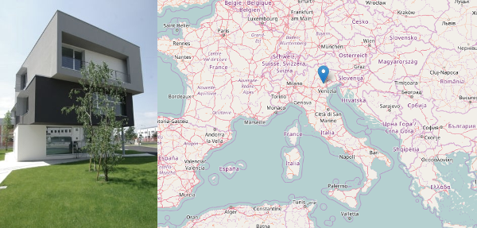
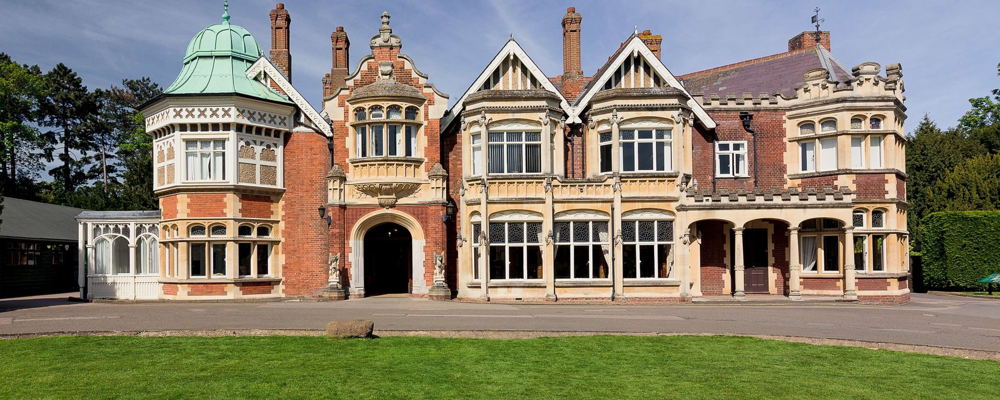

layout: true
.footer[
Stage at Bluewind: University Programme (www.bluewind.it)
]

???
---

.left-column[
## University Programme at Bluewind

]

.right-column[
# Bluewind

### Innovative product development University Programme

Bluewind provides world-class engineering solutions for electronics, safety critical applications, machine learning, connected devices.

We prepare interesting and challenging topics and we host University Students
for Stages during Master Thesis preparation and intermediate experiences.

Our Engineers are available without limitations of time and resources for coaching
and reviewing the results of students research work.

]

???
---

.left-column[
## University Programme at Bluewind

]

.right-column[
# Bluewind

 - Where we are
 - Who we are
 - What we do
 - What we offer
 
]

???
---

.left-column[
## University Programme at Bluewind

]

.right-column[
# Bluewind

### Where we are

 - Italy
 - I-31033 Castelfranco Veneto
 - Via della Borsa 16
 - cycling to/from railway station is possible
 - transportation to/from railway station arranged based on need

]

???
---

.left-column[
## University Programme at Bluewind

]

.right-column[
# Bluewind

### Who we are

  - 20+ experienced engineers providing full product design and covering the complete development process
  - 10+ engineers on site
  - 10+ engineers from remote either on a contract or research assignment basis
  - people from Italy and abroad

]

???
---

.left-column[
## University Programme at Bluewind

]

.right-column[
# Bluewind

### What we do

  - an independent engineering company
  - world-class engineering solutions
  - electronics, safety critical applications
  - machine learning on the edge, cyber security for connected devices
  - complete development process
  - product strategy, hardware and software design
  - regulations compliance, support for production
  - clients from Italy and Europe
  - founded in 1998

]

???
---

.left-column[
## University Programme at Bluewind

]

.right-column[
# Bluewind

### What we offer

  - list of engaging and challenging research topics
  - we look for University Students willing to acquire skills and satisfy curiosity
  - University Stage for Master Thesis
  - the student will be prepared for research and development, doctor's degree or business development careers
  - teamwork as a set of competencies the student will have the possibility to enhance
  - on site or remote positions available
  - willing to discuss any topic the student or Professor might want to suggest
  - reimbursement available
  - we hire almost all students after graduation

]

???
---

.left-column[
## People
]

.right-column[

* *stefano.costa@bluewind.it*
* Partner and Director of Engineering
* https://www.bluewind.it

[Back to index](index.html)
]
