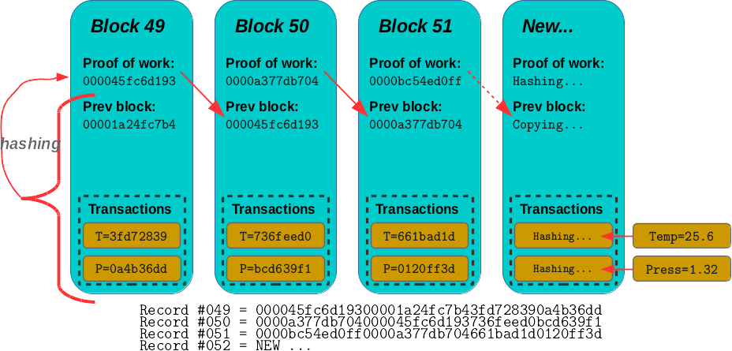
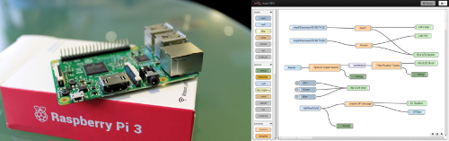

layout: true
.footer[
Stage at Bluewind: currently available topics
]

???
---

.left-column[
## Experiments on Blockchain
]

.right-column[
### Background on Blockchain

Blockchain’s distribute ledger was born as a new disruptive way for
exchaning payments and currencies.
From another point of view the technology behind blockchain has
much broader usecases: it provides device identity, secure data transfer
and immutable data storage during online transactions and communications.

]

???
---

.left-column[
## Experiments on Blockchain
]

.right-column[
### Summary of the stage

A group of students (minimum 10) will have a chance of:
 
 - studying the theory behind Blockchain
 - install, test and play with a network of Raspberry 3
prototyping boards running Node-RED
 - simulating a real blockchain ledger

]

???
---

.left-column[
## Experiments on Blockchain
]

.right-column[
### The theory behind Blockchain

Credits:
 
 - https://www.igvita.com/2014/05/05/minimum-viable-block-chain/

]

???
---

.left-column[
## Experiments on Blockchain
]

.right-column[
### The theory behind Blockchain

Properties of the Blockchain

1. Individual transactions are secured by PKI
2. Once created, transactions are broadcast into the P2P network
3. One or more transactions are aggregated into a "block"
4. Peers listen for new block announcements and merge them into their ledgers

The combination of all of the above rules
provides a decentralized peer-to-peer chain
for distributed consensus of ordering
of signed transactions.
]

???
---

.left-column[
## Experiments on Blockchain
]

.right-column[
### 1. Individual transactions are secured by PKI

Transactions are authenticated:

 - a malicious party can't masquerade as someone else and sign a transaction on their behalf
 - participants can't claim that the transaction did not happen after the fact
 - transactions can't be modified after the fact.
]

???
---

.left-column[
## Experiments on Blockchain
]

.right-column[
### 2. Once created, transactions are broadcast into the P2P network

 - participants form a network where transactions and blocks
   are relayed amongst all the participating peers
 - no central authority
]

???
---

.left-column[
## Experiments on Blockchain
]

.right-column[
### 3. One or more transactions are aggregated into a *block*

 - a block validates one or more transactions
 - valid block must have a valid proof-of-work solution
 - valid proof-of-work output is hard to generate and cheap to verify

Proof-of-work is used to raise the cost of generating
a valid block to impose a higher cost on running an attack
against the network.
]

???
---

.left-column[
## Experiments on Blockchain
]

.right-column[
### 4. Peers listen for new block announcements and merge them into their ledgers

 - inclusion of the transaction in a block
   acts as a "confirmation" of that transaction
 - each participant can choose their own level of risk tolerance
   ranging from 0-confirmation transactions
   to waiting for any arbitrary number of blocks
]

???
---

.left-column[
## Experiments on Blockchain
]

.right-column[
### Raspberry 3 and Node-RED

References for more information:

 - https://www.raspberrypi.org/
 - https://nodered.org/

]

???
---

.left-column[
## Experiments on Blockchain
]

.right-column[
### The goal: simulating a real blockchain ledger

The simulated blockchain ledger will be similar
to the Bitcoin existing infrastructure
but with the completely different target of making it
possible for:

 1. *devices*
 2. to *communicate*
 3. in a *secure* way
 4. on the *Internet*.
 
]

???
---

.left-column[
## People
]

.right-column[
* *stefano.costa@bluewind.it*
* Partner and Director of Engineering
* https://www.bluewind.it

[Back to index](index.html)
]
