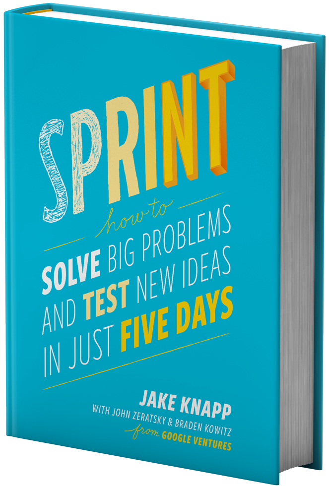
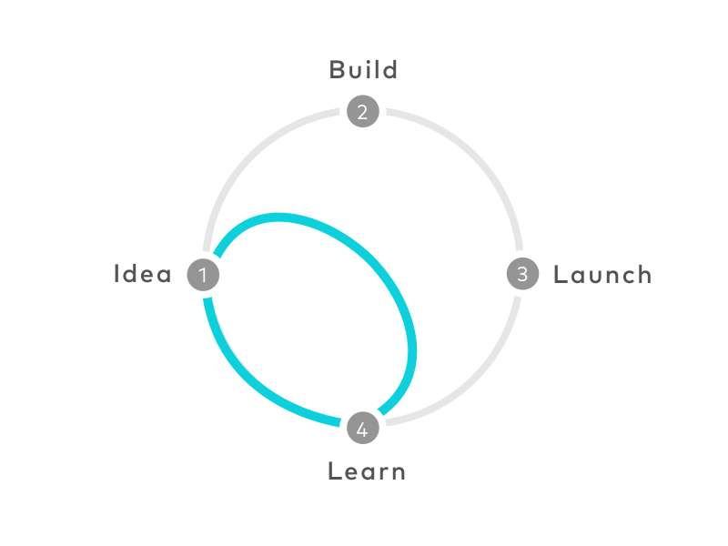
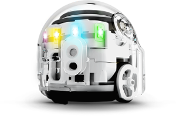
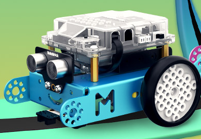

layout: true
.footer[
Stage at Bluewind: currently available topics
]

???
---

# Experiments on Autonomous Vehicles

### Design Sprint

### Building a real vehicle

???
---

.left-column[
## Experiments on Autonomous Vehicles
]

.right-column[
### Summary of the stage

A group of students (minimum 15) will behave like a team:
 
1. learn what a Design Sprint is
1. perform a one week Design Sprint
1. select one special feature as an outcome of the Sprint
1. build groups with 3-4 students
1. design and build an Autonomous Vehicle

]

???
---

.left-column[
## Experiments on Autonomous Vehicles
]

.right-column[
### Background on Design Sprint (1/3)

The purpose of a Design Sprint session is having useful
proof of concepts in a very limited timeframe,
before designing and building a real product.

]

???
---

.left-column[
## Experiments on Autonomous Vehicles
]

.right-column[
### Background on Design Sprint (2/3)

The group of 15 students will be trained and will conduct
a full Design Spring session during the first week of stage
in order to decide the exact features that they will
develop during the rest of the time assigned to the activities.

Marco Dussin and Ivano Masiero (consultants) will help during the Design Sprint.

.pull-left[]
.pull-right[]
]

???
---

.left-column[
## Experiments on Autonomous Vehicles
]

.right-column[
### Background on Design Sprint (3/3)

* Monday: you’ll map out the problem and pick an important place to focus
* Tuesday: you’ll sketch competing solutions on paper
* Wednesday: you’ll make difficult decisions and turn your ideas into a testable hypothesis
* Thursday: you’ll hammer out a high-fidelity prototype
* Friday: you’ll test it with real live humans

]

???
---

.left-column[
## Experiments on Autonomous Vehicles
]

.right-column[
### Background on the Autonomous Vehicle (1/2)

We want to build a small vehicle that:

1. carries a small payload (<5Kg)
1. drives autonomously
1. follows a path drawn using coloured pencils or spray colours
1. people creates new drive functions on a web site
1. the created functions can be downloaded to a vehicle

]

???
---

.left-column[
## Experiments on Autonomous Vehicles
]

.right-column[
### Background on the Autonomous Vehicle (2/2)

The product idea comes from existing offers OZOBOT and MROBOT.

Students will have to carefully examine the model and try to
invent the new product, having in mind the important constrain
that it should be possible to build it during the stage.

.pull-left[]
.pull-right[]
]

???
---

.left-column[
## Experiments on Autonomous Vehicles
]

.right-column[
### Some useful prerequisites (1/5)

Teachers have the opportunity to assist students during the lessons 
with topics and links suggested here.

]

???
---

.left-column[
## Experiments on Autonomous Vehicles
]

.right-column[
### Some useful prerequisites (2/5)

### Design Sprint: read the book and understand the general idea

* http://www.gv.com/sprint/

]

???
---

.left-column[
## Experiments on Autonomous Vehicles
]

.right-column[
### Some useful prerequisites (3/5)

### OZOBOT: understand the use model, try describing with User Stories

* https://ozobot.com/
* http://store.makeblock.com/product/mbot-robot-kit
* https://www.mountaingoatsoftware.com/agile/user-stories

]

???
---

.left-column[
## Experiments on Autonomous Vehicles
]

.right-column[
### Some useful prerequisites (4/5)

### Autonomous vehicles: ROS Industrial as a software platform

* http://www.theconstructsim.com/start-self-driving-cars-using-ros/

]

???
---

.left-column[
## Experiments on Autonomous Vehicles
]

.right-column[
### Some useful prerequisites (5/5)

### Autonomous vehicles: ROS Industrial applied

* http://duckietown.mit.edu/

]

???
---

.left-column[
## People
]

.right-column[
* *stefano.costa@bluewind.it*
* Partner and Director of Engineering
* https://www.bluewind.it

[Back to index](index.html)
]
