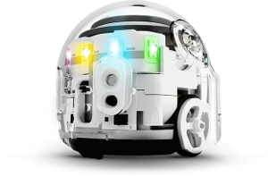

layout: true
.footer[
Stage at Bluewind: currently available topics
]

???
---

# Experiments on Autonomous Vehicles and Machine Learning

### Voice Activated Vehicle

???
---

.left-column[
## Voice Activated Vehicle
]

.right-column[
### Summary of the stage

A group of 8 students will behave like a set of teams:
 
1. build teams with 2-3 students
1. perform in three one-week sprints
1. select features to be developed during sprints
1. design and build voice activation algorithms for a small vehicle

]

???
---

.left-column[
## Voice Activated Vehicle
]

.right-column[
### Background on the Autonomous Vehicle (1/3)

We want to add voice activation to a small vehicle that:

1. carries a small payload (<5Kg)
1. drives autonomously
1. follows directions given by voice

]

???
---

.left-column[
## Voice Activated Vehicle
]

.right-column[
### Background on the Autonomous Vehicle (2/3)

The product idea builds on existing offerings from https://www.makeblock.com/.

Students will carefully examine the model and invent the new feature
with the important constrain that it should be possible to build it
during the stage. Bluewind offers two pieces of the selected platform
as a development base.

.pull-left[]
.pull-right[]
]

???
---

.left-column[
## Voice Activated Vehicle
]

.right-column[
### Background on the Autonomous Vehicle (3/3)

The important feature to be identified and developed involves hearing voice
and selecting operations based on the words (voice command) and direction
of sound (voice directions).

One important software and experience starting point is a stage
work developed during 2018 by a group of students and known as
Project Vivaldi.

]

???
---

.left-column[
## Voice Activated Vehicle
]

.right-column[
### Some useful prerequisites (1/6)

Teachers have the opportunity to assist students during the lessons 
with topics and links suggested here.

]

???
---

.left-column[
## Experiments on Autonomous Vehicles
]

.right-column[
### Some useful prerequisites (2/6)

## Artificial Intelligence and Machine Learning: the big picture

* https://vas3k.com/blog/machine_learning

]

???
---

.left-column[
## Experiments on Autonomous Vehicles
]

.right-column[
### Some useful prerequisites (3/6)

## Project Vivaldi (2018)

[Project Vivaldi: the document (Stage 2018)](assets/VivaldiProject_overview_Rev5.pdf)

]

???
---

.left-column[
## Experiments on Autonomous Vehicles
]

.right-column[
### Some useful prerequisites (4/6)

## How to think and write User Stories: try describing one feature with User Stories

* https://www.mountaingoatsoftware.com/agile/user-stories

]

???
---

.left-column[
## Experiments on Autonomous Vehicles
]

.right-column[
### Some useful prerequisites (5/6)

## Makeblock vehicles: study the features, try hacking

* https://www.makeblock.com

]

???
---

.left-column[
## Experiments on Autonomous Vehicles
]

.right-column[
### Some useful prerequisites (6/6)

## Autonomous vehicles: ROS Industrial as a software platform

* http://www.theconstructsim.com/start-self-driving-cars-using-ros/
* http://duckietown.mit.edu/

]

???
---

.left-column[
## People
]

.right-column[
* *stefano.costa@bluewind.it*
* Partner and Director of Engineering
* https://www.bluewind.it

[Back to index](index.html)
]
