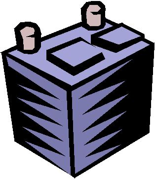
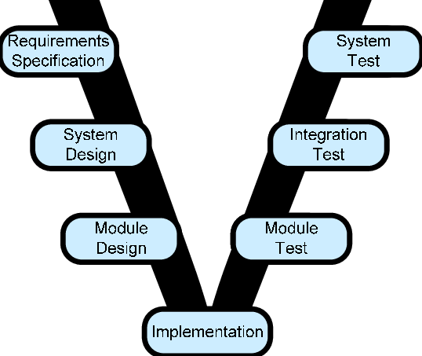

layout: true
.footer[
Stage at Bluewind: currently available topics for University (www.bluewind.it)
]

???
---

.left-column[
## University programme at Bluewind

]

.right-column[

A list of topics that we submit to University Students willing to work on an engaging
environment in order to acquire skills and satisfy curiosity for a brilliant career.

At the end of a University Stage for Master Thesis the student is prepared for research and
development, doctor's degree or business development careers. Teamwork skill
is both a requirement and a set of competencies the student will have the possibility
to enhance.

On site or remote positions available.

]

???
---

.left-column[
## University (1)

]

.right-column[
### Social Distancing Control using existing infrastructure (1/3)

Covid19 left the World with a need for reinventing ways for gathering in person in spaces.

Laws and best practices enforce meeting in person if and only if some very simple rules are met:
number of persons in a room, and distance between persons higher than a limit.

]

???
---

.left-column[
## University (1)

]

.right-column[
### Social Distancing Control using existing infrastructure (2/3)

Social Distancing Control products exist that rely on:

* smart and small radar sensors
* vision systems coupled to Machine Learning
* infrared sensors
* tags or mobile phones to be held by people
* QR Code signs entering and exiting a room

]

???
---

.left-column[
## University (1)

]

.right-column[
### Social Distancing Control using existing infrastructure (3/3)

At Bluewind we're experimenting and developing innovative ways for counting
people and measuring crowding factors in rooms and open spaces.

We rely on Machine Learning algorithms to be deployed on edge devices (small
and cheap embedded devices) and measurements on existing or injected radio
frequency.

Improvements and new directions are topics for one or more students.
]

???
---

.left-column[
## University (2)

]

.right-column[
### Determine the State of Health of a vehicle battery with Machine Learning (1/3)

Building on the foundations of an existing Master Thesis (developed at Bluewind)
the student will use define a practical use case and perform measurements,
experimentations and validation of algorithms in a real situation.

]

???
---

.left-column[
## University (2)

]

.right-column[
### Determine the State of Health of a vehicle battery with Machine Learning (2/3)

We have access to dataset coming from industries willing to share measurements done
on real vehicles, and thus performing an accurate learning process is possible.

We also have ideas on how to benefit from using 
]

???
---

.left-column[
## University (2)

]

.right-column[
### Determine the State of Health of a vehicle battery with Machine Learning (3/3)

Machine Learning algorithms for battery State of Health and State of Charge
evaluation promises to give useful information to the user(s) of an electrical
vehicle with much better accuracy and less effort than traditional
test-based measurements. Additionally, this is a perfect use case for Machine
Learning algorithms on the edge: machine learning deployed in an embedded
system instead of being run on a Cloud or High Performance computing platform.

]

???
---

.left-column[
## University (3)

]

.right-column[
### Machine Learning on the edge: security and encryption (1/4)

Machine Learning algorithms can be deployed
inside embedded systems with very limited computing resources, thanks
to some vendor-specific and opensource translating solutions.

We're developing advanced and industry-ready examples and applications
in this domain at Bluewind.

]

???
---

.left-column[
## University (3)

]

.right-column[
### Machine Learning on the edge: security and encryption (2/4)

One interesting area of investigation is *Machine Learning over encrypted data*.

Applying Machine Learning requires that a great part of an algorithm, memorized
data and acquired data samples (audio, video, measurements) is subject to efficient
and in-line computation.

This makes it difficult to keep a safe and protected
environment (memory and execution) in place, with solutions like
TPM (Trusted Platform Module)
or TEE Trusted Execution Environment) for embedded devices.

]
  
???
---

.left-column[
## University (3)

]

.right-column[
### Machine Learning on the edge: security and encryption (3/4)

The student will investigate on existing algorithms and solutions that perform
Machine Learning on encrypted data during learning and selection.

After an initial feasibility study, one selected solution will be applied
for demonstration purposes in accordance and collaboration with a preminent
Semiconductor Manufacturer, offering solutions for Machine Learning on embedded.

]

???
---

.left-column[
## University (3)

]

.right-column[
### Machine Learning on the edge: security and encryption (4/4)

Some ideas for the demonstration:

* an improvement on [Bluewind Vivaldi example application](https://www.bluewind.it/case-study/vivaldi-edge-machine-learning/) with privacy concerns in mind
* building a reliable and secure People Counter and Social Distancing Proof of Concept or Product for contrast to Covid19 new requirements

]

???
---

.left-column[
## University (4)

]

.right-column[
### Software development for Functional Safety (1/3)

A review of available best practices and tools as aids for Functional Safety Concerned
software development in the domain of Embedded Systems Development.

A comparison between commercial tools, open source availability and in-house crafted
develompent and documentation cycles is the first outcome of this study.

]

???
---

.left-column[
## University (4)

]

.right-column[
### Software development for Functional Safety (2/3)

The identification of a simple, effective and reasonable solution based on a mixture
of commercial and opensource solutions is the final target.

]

???
---

.left-column[
## University (4)

]

.right-column[
### Software development for Functional Safety (3/3)

The areas of interest as requested by the Safety norms are:

* static analysis of source code
* requirements tracking
* test cases and results tracking
* change management

]

???
---

.left-column[
## University (5)

]

.right-column[
### Blockchain usecases for the Internet of Things applications (1/4)

Blockchain’s distribute ledger was born as a new disruptive way for
exchaning payments and currencies.
]

???
---

.left-column[
## University (5)

]

.right-column[
### Blockchain usecases for the Internet of Things applications (2/4)

From another point of view the technology behind blockchain has
much broader usecases: it provides device identity, secure data transfer
and immutable data storage during online transactions and communications.
]

???
---

.left-column[
## University (5)

]

.right-column[
### Blockchain usecases for the Internet of Things applications (3/4)

Among the most interesting features, it can be implemented without
any centralized authority. A blockchain can be used as a completely
transparent system with cryptographic proofs of identity and integrity.
]
  
???
---

.left-column[
## University (5)

]

.right-column[
### Blockchain usecases for the Internet of Things applications (4/4)

During the stage two students will identify the best approach for
implementing a blockchain network in resources-constrained applications, and will:

* select an example use case
* select a suitable safe programming language for embedded (ADA, RUST, etc.)
* develop a set of libraries and applications for secure identificatoin and communication with a cloud platform
]

???
---

.left-column[
## University (6)

]

.right-column[
### Intrusion Detect System (IDS) for edge devices using Machine Learning (1/4)

Edge devices are electronic devices connected to the Internet for data collecting.
Think of the thermostat or refrigerator linked to some cloud service, or a car
connected to a database for predictive maintenance.
]

???
---

.left-column[
## University (6)

]

.right-column[
### Intrusion Detect System (IDS) for edge devices using Machine Learning (2/4)

Intentional intrusion on edge devices from the Internet is known to be a very serious problem for several reasons:

* safety
* reputation
* loss of control

]

???
---

.left-column[
## University (6)

]

.right-column[
### Intrusion Detect System (IDS) for edge devices using Machine Learning (3/4)

Unfortunately, developing devices with very limited cost, complexity, memory footprint and size imposes
a limit to the technologies that can be deployed in order to build secure edge connected products.

]

???
---

.left-column[
## University (6)

]

.right-column[
### Intrusion Detect System (IDS) for edge devices using Machine Learning (4/4)

Building on years of experience at Bluewind deploying Machine Learning on resurces-constrained electronic products
we propose to investigate on the possibility to adopt such technology for affordable and secure IDS on edge devices.
The student will collect data using Open Source forensic tools, study literature and identify the best strategy
leveraging the latest trends on GAN networks for enhancing training-based neural networks on unknwon domains. She will
develop a deep knowledge on how to build software for embedded devices with an eye to efficiency and high quality.

]

???
---

.left-column[
## People
]

.right-column[
* *stefano.costa@bluewind.it*
* Partner and Director of Engineering
* https://www.bluewind.it

[Back to index](index.html)
]
